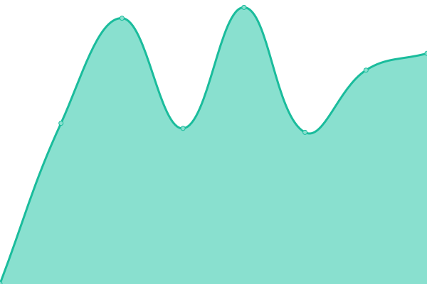

# [📈 Live Status](https://upptime.raitisoja.cloud): <!--live status--> **🟩 All systems operational**

This repository contains the open-source uptime monitor and status page for [Markku Raitisoja](https://cv.markku.raitisoja.com/), powered by [Upptime](https://github.com/upptime/upptime).

With [Upptime](https://upptime.js.org), you can get your own unlimited and free uptime monitor and status page, powered entirely by a GitHub repository. We use [Issues](https://github.com/mraitisoja/upptime/issues) as incident reports, [Actions](https://github.com/mraitisoja/upptime/actions) as uptime monitors, and [Pages](https://upptime.raitisoja.cloud) for the status page.

<!--start: status pages-->
<!-- This summary is generated by Upptime (https://github.com/upptime/upptime) -->
<!-- Do not edit this manually, your changes will be overwritten -->
<!-- prettier-ignore -->
| URL | Status | History | Response Time | Uptime |
| --- | ------ | ------- | ------------- | ------ |
|  [Friendica social Site](https://social.raitisoja.net) | 🟩 Up | [friendica-social-site.yml](https://github.com/mraitisoja/upptime/commits/HEAD/history/friendica-social-site.yml) | 

 943ms
     
 | 

<a href="https://upptime.raitisoja.cloud/history/friendica-social-site">100.00%</a>
    

|  [Streams site](https://raitisoja.com) | 🟩 Up | [streams-site.yml](https://github.com/mraitisoja/upptime/commits/HEAD/history/streams-site.yml) | 

 991ms
     
 | 

<a href="https://upptime.raitisoja.cloud/history/streams-site">100.00%</a>
    

|  [Tiny Tiny RSS](https://feeds.raitisoja.cloud) | 🟩 Up | [tiny-tiny-rss.yml](https://github.com/mraitisoja/upptime/commits/HEAD/history/tiny-tiny-rss.yml) | 

 1115ms
     
 | 

<a href="https://upptime.raitisoja.cloud/history/tiny-tiny-rss">32.67%</a>
    

|  [Markku's Forgejo](https://git.raitisoja.cloud) | 🟩 Up | [markku-s-forgejo.yml](https://github.com/mraitisoja/upptime/commits/HEAD/history/markku-s-forgejo.yml) | 

 1030ms
     
 | 

<a href="https://upptime.raitisoja.cloud/history/markku-s-forgejo">100.00%</a>
    

<!--end: status pages-->

[**Visit our status website →**](https://upptime.raitisoja.cloud)

## 📄 License

- Powered by: [Upptime](https://github.com/upptime/upptime)
- Code: [MIT](./LICENSE) © [Anand Chowdhary](https://anandchowdhary.com), supported by [Pabio](https://pabio.com)
- Data in the `./history` directory: [Open Database License](https://opendatacommons.org/licenses/odbl/1-0/)
